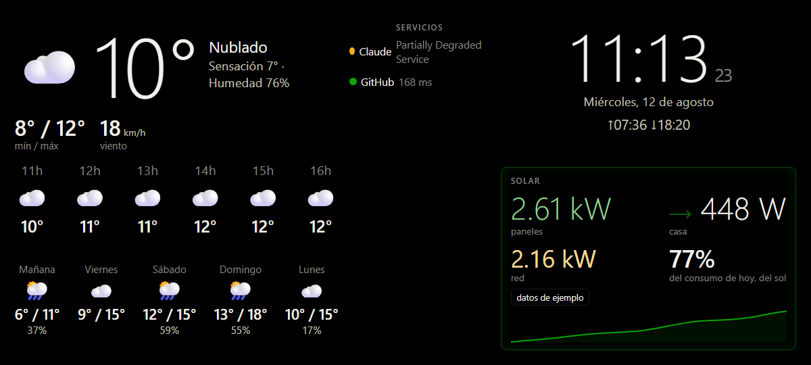

# display-kiosk

Convertí un teléfono viejo en un display de escritorio que muestra el clima, tus paneles solares, la hora y el estado de tus servicios. Corre 24/7, se actualiza solo y no cuesta nada: todo vive en un único Worker del plan gratuito de Cloudflare.



*(captura en modo demo: los datos solares son de ejemplo, el resto es real)*

## Qué muestra

- **Clima** — temperatura, sensación térmica, humedad, viento, mínima/máxima, pronóstico por hora y de 5 días. Sale de [Open-Meteo](https://open-meteo.com/) (gratis, sin API key). Opcionalmente puede mezclar mediciones de una estación meteorológica local.
- **Solar** — lo que entregan los paneles, lo que consume la casa, lo que entra o sale de la red, el porcentaje del consumo del día cubierto por el sol y la curva de generación de la jornada. Vía la API de [SolaxCloud](https://developer.solaxcloud.com); el marco del widget se pone verde cuando los paneles cubren el consumo y ámbar cuando estás comprando de la red.
- **Hora y fecha** con salida y puesta del sol.
- **Servicios** — semáforo con la latencia de las URLs que le indiques. Entiende chequeos HTTP comunes y páginas de estado tipo [Statuspage](https://www.atlassian.com/software/statuspage) (Claude, GitHub, Cloudflare, etc.).

**Sin credenciales de Solax funciona igual**, en modo demo con datos de ejemplo: podés deployarlo y verlo andando en dos minutos.

## Cómo funciona

Un solo Worker de Cloudflare hace las dos cosas: sirve el frontend (React + Vite) y expone `/api/*`, que hace de proxy y cache de las APIs externas.

```
Teléfono (Fully Kiosk)  →  Cloudflare Worker  →  Open-Meteo / SolaxCloud / tus URLs
     polling 1-10 min        cache 60-600 s
```

Por qué el proxy y no llamar a las APIs desde el navegador:

- Las credenciales de SolaxCloud nunca salen del servidor.
- Solax no habilita CORS, así que el navegador no puede llamarla directo.
- El cache protege los límites de las APIs aunque tengas varias pantallas abiertas.

Si una API externa falla, el Worker sirve el último dato bueno (hasta 24 h) marcado como viejo, y el widget muestra un `⚠ hace N min` en vez de vaciarse.

## Puesta en marcha

Necesitás [Node 20+](https://nodejs.org/) y una cuenta (gratuita) de [Cloudflare](https://dash.cloudflare.com/sign-up).

### 1. Instalar y probar local

```bash
git clone https://github.com/NicolasRocchia/display-kiosk.git
cd display-kiosk
npm install
npm run dev
```

Abrí `http://localhost:5173`: ya deberías ver el display funcionando con clima real y datos solares de ejemplo.

### 2. Ponerlo en internet

```bash
npx wrangler login
npm run deploy
```

Al terminar te da la URL pública (`https://display-kiosk.TU-SUBDOMINIO.workers.dev`). Esa es la que va a abrir el teléfono.

### 3. Ajustar la configuración

En [`wrangler.jsonc`](wrangler.jsonc), sección `vars`:

| Variable | Para qué |
|---|---|
| `LATITUDE` / `LONGITUDE` | Tu ubicación para el clima. Click derecho en Google Maps copia las coordenadas. |
| `TIMEZONE` | Zona horaria IANA, ej. `America/Argentina/Buenos_Aires`. |
| `MONITOR_URLS` | JSON con los servicios a vigilar: `[{"name":"Mi API","url":"https://..."}]`. Agregá `"type":"statuspage"` si la URL es el `status.json` de una Statuspage. |
| `LOCAL_STATION` | Estación meteorológica local (opcional, ver abajo). Vacío = solo Open-Meteo. |

Después de tocar este archivo: `npm run cf-typegen && npm run deploy`.

### 4. Conectar tu inversor Solax (opcional)

1. Entrá a [developer.solaxcloud.com](https://developer.solaxcloud.com) con tu cuenta de SolaxCloud.
2. **Application → crear una aplicación**. Al elegir permisos alcanza con *Information Access Service* y *Data Monitoring Service*: son de solo lectura. Dejá sin marcar todo lo que diga *Control*, así la credencial no puede tocar tu inversor.
3. Copiá el **Client ID** y el **Client Secret**.
4. Cargalos como secrets:

```bash
npx wrangler secret put SOLAX_CLIENT_ID
npx wrangler secret put SOLAX_CLIENT_SECRET
```

5. Para desarrollo local, copiá `.dev.vars.example` a `.dev.vars` y completalos ahí.

No hace falta configurar el número de serie: el Worker descubre solo el inversor y la planta asociados a la cuenta.

> **Si en Windows usás PowerShell, no cargues los secrets con un pipe** (`"valor" | npx wrangler secret put ...`): le agrega un salto de línea al final y Solax rechaza la credencial con *Bad client credentials*. Usá el comando interactivo de arriba o `npx wrangler secret bulk archivo.json`.

### 5. Estación meteorológica local (opcional)

Open-Meteo da un pronóstico modelado muy bueno, pero si tenés una estación real cerca, sus mediciones le ganan. El proyecto trae un adaptador de ejemplo: la estación pública de la [UTN Facultad Regional San Francisco](https://climatologia.sanfrancisco.utn.edu.ar/tiempo/) (Córdoba, Argentina), que además reporta radiación solar.

Para activarla, poné `"LOCAL_STATION": "utn-san-francisco"` en `wrangler.jsonc`. Viene desactivada por defecto: solo tiene sentido si estás en esa zona, y así nadie le manda tráfico innecesario a un servicio ajeno.

Para enchufar otra estación, copiá [`worker/sources/stations/utnSanFrancisco.ts`](worker/sources/stations/utnSanFrancisco.ts), adaptá el parseo a su formato y sumá la entrada en [`stations/index.ts`](worker/sources/stations/index.ts). El clima queda híbrido solo: lo medido lo pone la estación, lo modelado (icono, UV, pronósticos) Open-Meteo, y si la estación se cuelga todo cae a Open-Meteo sin que se note.

## El teléfono como kiosk

Cualquier Android en desuso sirve. La app es [Fully Kiosk Browser](https://www.fully-kiosk.com/) (la versión gratuita alcanza):

1. Instalala desde Play Store y poné tu URL de `workers.dev` como **Start URL**.
2. Activá **Keep Screen On**, **Launch on Boot** y **Restart after Crash**.
3. En *Web Content Settings*, activá **Auto Reload on Error** para que se recupere solo si se corta el WiFi.
4. Activá el modo fullscreen / immersive para ocultar las barras del sistema.
5. En Xiaomi/MIUI (y varias capas chinas): permitile **autostart** a Fully y sacale la optimización de batería, o el sistema la va a matar de madrugada.

El display se cuida solo: recarga completa todos los días a las 04:30 para evitar fugas de memoria, y cada 10 minutos chequea si hay una versión nueva deployada y se actualiza sin que toques el teléfono.

**Cuidado con la batería**: un teléfono enchufado 24/7 se hincha con el tiempo. Lo ideal es un enchufe inteligente con horarios, para que cargue solo unas horas por día.

> **Si el teléfono no abre la URL** y da un error de DNS o de SSL: algunos ISP filtran el dominio `workers.dev` completo. La solución más rápida es ponerle un DNS privado al teléfono (*Ajustes → Conexión y compartir → DNS privado → `dns.google`*). La definitiva es apuntar un dominio propio al Worker.

## Diseño del display

Pensado para mirarse todo el día sin molestar:

- Fondo negro puro: en pantallas AMOLED los píxeles negros están apagados, así que consume menos y no genera brillo.
- Todo el contenido se desplaza unos píxeles cada 5 minutos para evitar el *burn-in*.
- Tipografías en `vmin`: se adapta solo a la orientación y al tamaño de cualquier pantalla.
- El color se usa para el estado (verde/ámbar/rojo), nunca como decoración, y siempre acompañado de texto.

## Agregar un widget

La arquitectura está pensada para que sumar una fuente sea corto:

1. **Worker**: creá `worker/sources/loQueSea.ts` con una función que devuelva datos ya normalizados y registrala en [`worker/sources/index.ts`](worker/sources/index.ts) con su TTL de cache. Eso te da `/api/loQueSea` con cache, manejo de errores y datos viejos servidos ante caídas.
2. **Frontend**: creá `src/widgets/LoQueSeaWidget.tsx` usando el hook `useWidgetData`, agregalo a [`src/widgets/registry.ts`](src/widgets/registry.ts) y definí su área en la grilla de `src/theme.css`.

## Costos y límites

Con el plan gratuito de Cloudflare y una sola pantalla, esto no cuesta nada y queda lejísimos de cualquier límite:

- **Cloudflare Workers**: 100.000 requests/día gratis; el display usa unos 4.500. Los archivos estáticos no cuentan.
- **Open-Meteo**: gratis para uso no comercial; el cache lo consulta 1 vez cada 10 minutos.
- **SolaxCloud**: el paquete gratuito del portal permite 100 llamadas por minuto; el display usa 2 por minuto. Ojo que el inversor sube datos a la nube cada ~5 minutos, así que ese es el límite real de frescura del dato, no el polling.

## Estado del proyecto

Es un proyecto personal, hecho para andar en mi escritorio. Funciona, pero está probado en un solo escenario: un inversor Solax monofásico residencial sin batería, en Argentina. El código de baterías está preparado en los tipos pero no implementado (en la API de Solax son otro dispositivo, con su propia consulta).

Si lo usás y encontrás algo, los issues y PRs son bienvenidos.

## Licencia

MIT — hacé lo que quieras con esto.
